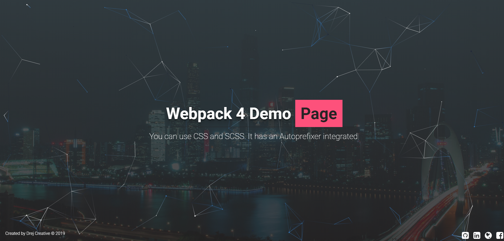

# Movie Place
[Visit App](https://github.com/drejcreative/webpack-4-setup)

This is Webpack 4 Development setup which has a good starting setup for website and web apps build. You can use the latest and greatest fro JavaScript world as it has Babel Integrated.

> You can use CSS or SCSS or Both. It has Autoprefixer integrated. You can change Autoprefixer covering range in `package.json`.

> You can use Icon Fonts, Fonts, Images and it will work outside the box. 

> It has an integrated web server with live reload on file change.

## Development server
Run `npm dev` for a dev server. It will automatically open your default browser and show the app. It has live reload integrated.

## Build
Run `npm prod` to build the project. The build artifacts will be stored in the `dist/` directory. Files are minified and ready for production.
